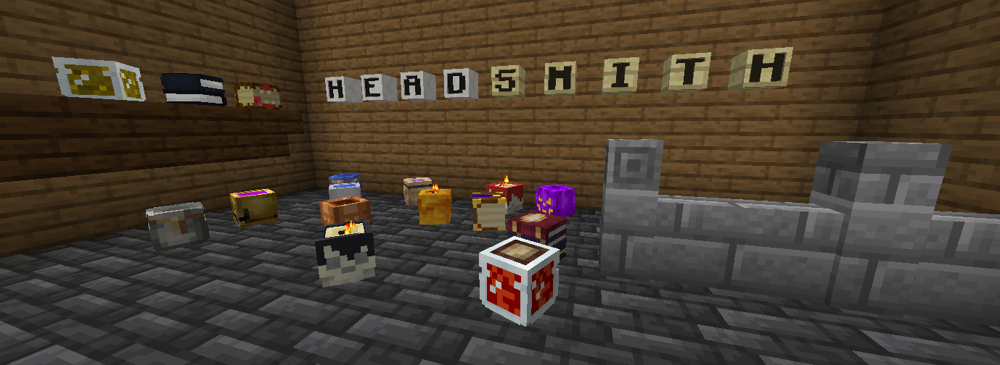

# HeadSmith

A Minecraft Paper plugin adding a variety of survival-friendly decorative and functional heads.

- Download on Modrinth: **Coming Soon!**
- Head Catalog: [def9a2a4.github.io/HeadSmith](https://def9a2a4.github.io/HeadSmith/)

## Features

- **Head Catalog** - Browse hundreds of custom textured heads through an in-game menu: `/headsmith show`
- **Search** - Find heads by name or tags `/headsmith search <query>` or [def9a2a4.github.io/HeadSmith](https://def9a2a4.github.io/HeadSmith/)
- **Crafting** - Depending on the head, craft using shaped/shapeless recipes or stonecutter recipes.
- **Drops** - Control what drops when heads are broken (silk touch support). For example, a [bottle of redstone]() when broken will just drop redstone dust unless broken with silk touch.
- **Special Properties**:
  - Lightable [candles]() with particle effects
  - Glowing pumpkins and glowstone
  - Functional blocks that open crafting tables, anvils, enchanting tables, looms, and more

## Commands

| Command                                       | Description                               | Permission          |
| --------------------------------------------- | ----------------------------------------- | ------------------- |
| `/headsmith show`                             | Open the head catalog menu                | `headsmith.catalog` |
| `/headsmith search <query>`                   | Search for heads by name or tag           | `headsmith.catalog` |
| `/headsmith reload`                           | Reload configuration and head definitions | `headsmith.admin`   |
| `/headsmith give <head_id> [player] [amount]` | Give a head to a player                   | `headsmith.admin`   |

## Configuration

Heads are defined in YAML files and loaded via `config.yml`. Each head can have:

- Custom texture (base64 encoded skin data)
- Display name and lore
- Tags for organization and searching
- Special properties (lightable, glowing, workbench, etc.)
- Crafting recipes (shaped/shapeless)
- Stonecutter recipes
- Drop rules with silk touch conditions

See the `headsmith/src/main/resources/heads/` directory for examples.